## Step 1: Important Instructions

To ensure the lab runs faster and without disconnection, please:

1. Disconnect from VPN.
2. Disconnect from the Eagle network.
3. Connect to Walmart WiFi.

## Step 2: Access the Lab Portal

Go to the following link and log in using your lab credentials:

[https://cloudlabs.nuvepro.com/company/upGradLabs/home](https://cloudlabs.nuvepro.com/company/upGradLabs/home)

Step 3. Click on View Lab

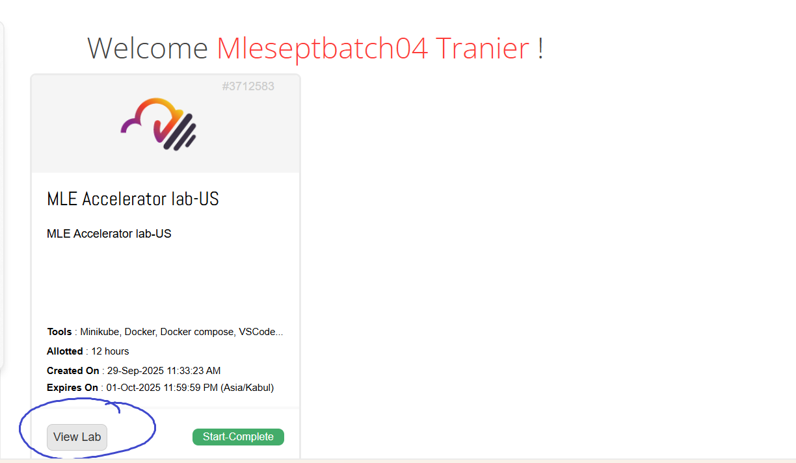

Step 4. Click on Start

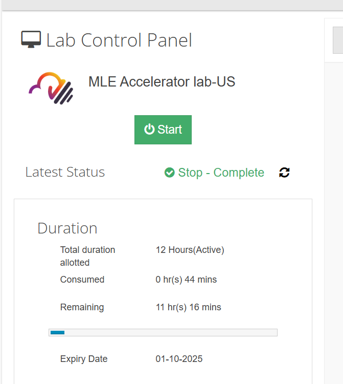

Step 5: Click on Web Desktop Access

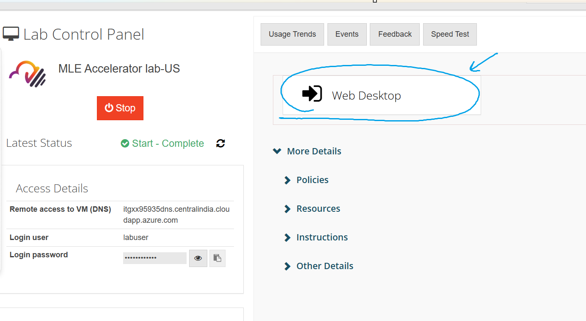

Step 6: Open Command prompt inside lab environment

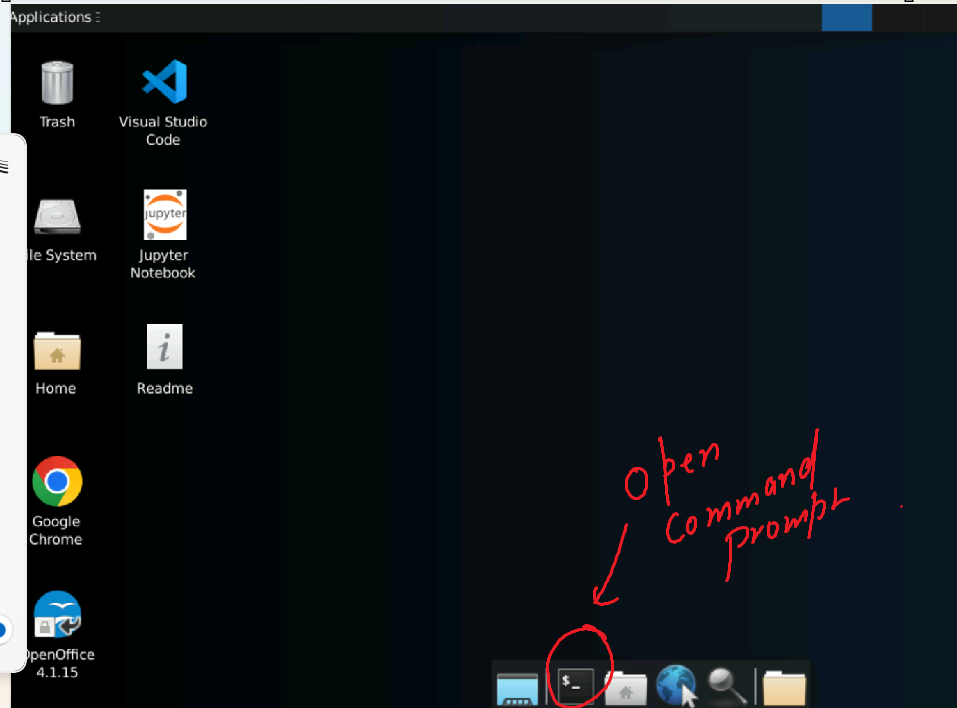

Step 7: Clone a Repo

git clone https://github.com/technoavengers/mlops_training.git

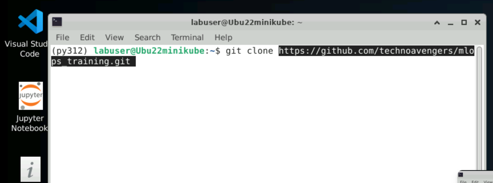

Step 8: Go inside mlops_training folder

cd mlops_training

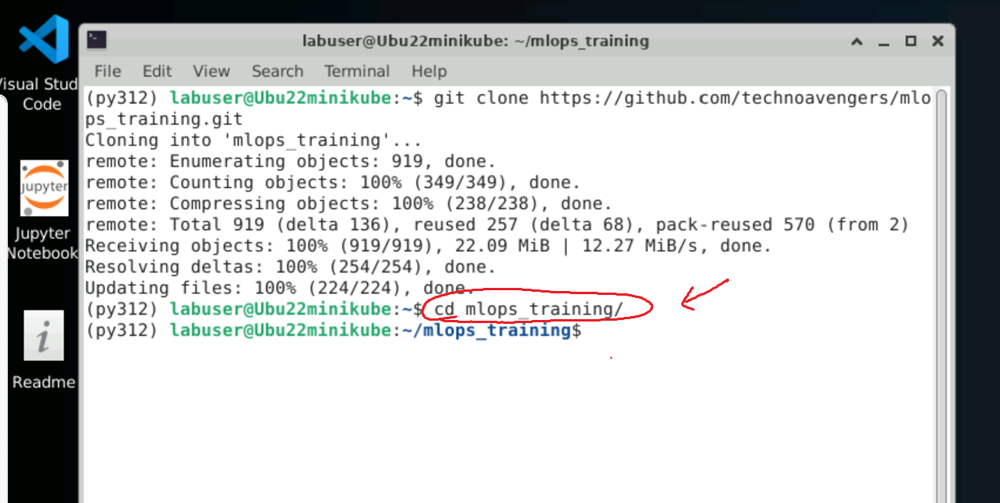

Step 9: Open mlops_training folder in Vs Studio code

code .

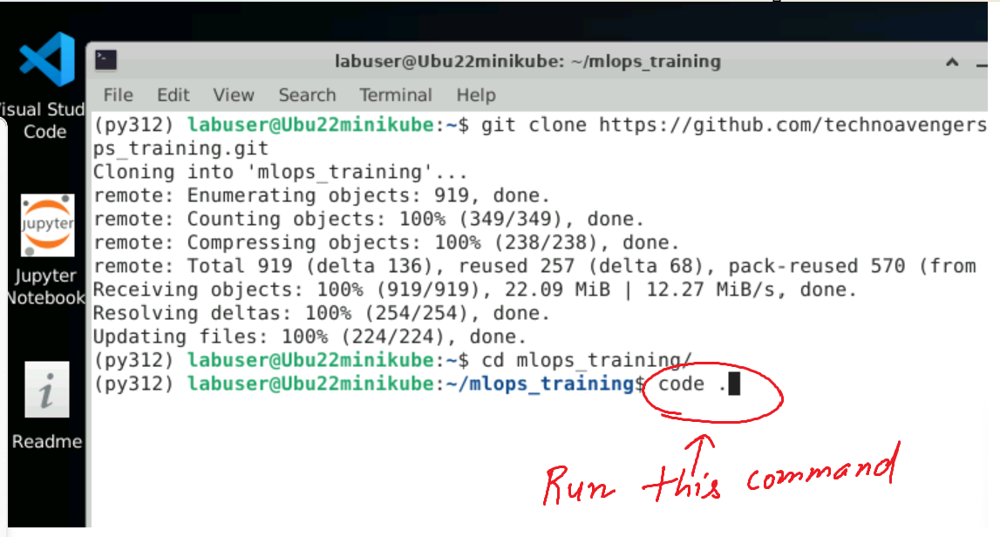

Step 10: Open Labs/Lab1/challenge/instructions.ipynb

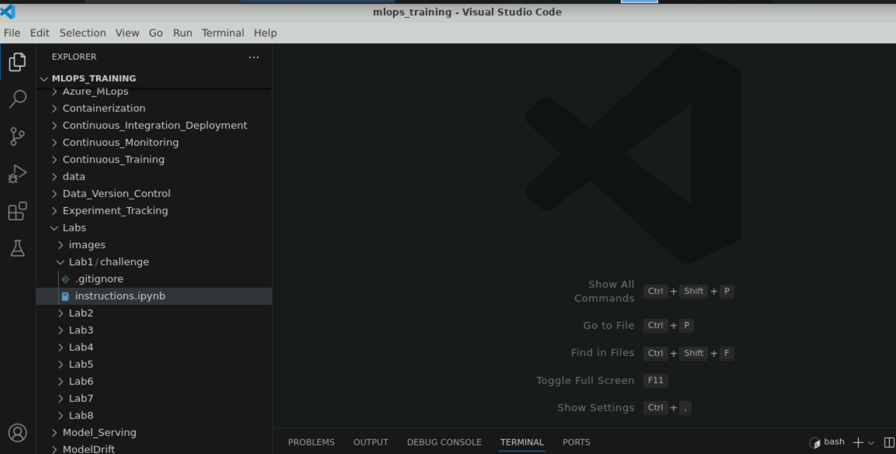

Step 11: Select Kernel

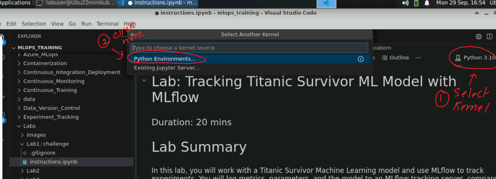

Step 12: Choose python

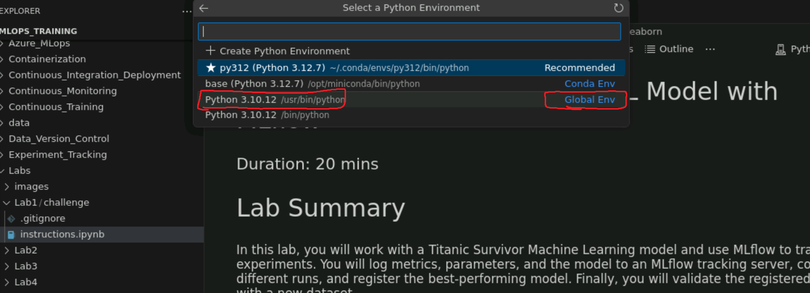

Step 13: Run the first cell in notebook

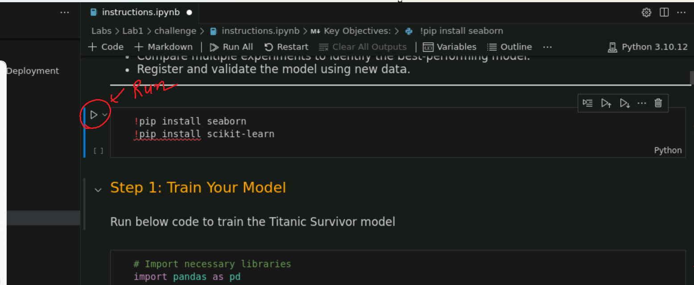

Step 14: Install Ipykernel Package

Step 15: You are all set and Ready, Proceed now

